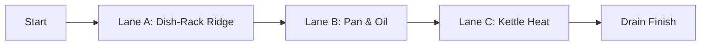

# Sink Drop — Game Design Document

> **Project:** Sink Drop 
> **Theme:** *Miniature*  

**Project Brief:** You are a **single water droplet** navigating a **kitchen‑sink scene.**. Understand the **surface** (hydrophilic vs hydrophobic), alter the **surface tension** (stamina), and solve three puzzles to reach the **drain** in under **ten minutes**.

---

## Table of Contents
- [1. Game Overview](#1-game-overview)
- [2. Story](#2-story)
- [3. Gameplay](#3-gameplay)
- [4. Levels & World Design](#4-levels--world-design)
- [5. Art & Audio](#5-art--audio)
- [6. User Interface (UI)](#6-user-interface-ui)
- [7. Technology & Tools](#7-technology--tools)
- [8. Shaders & Special Effects](#8-shaders--special-effects)
- [9. Evaluation](#9-evaluation)
- [10. Team Communication, Timeline & Roles](#10-team-communication-timeline--roles)
- [11. Risks](#11-risks)
- [12. Image & GIFs](#12-image--gifs)


---

## 1. Game Overview
**Core concept:** A short, single‑player 3D puzzle game about surface tension. The droplet can cling to wettable materials, slide off hydrophobic ones, split/merge to change mass/footprint, and evaporate near heat. The *Miniature* theme is expressed via everyday objects at giant scale: dish‑rack - **mountains**, kettle - **volcano**, oil - **lava**.

**Related genres.** Puzzle games, physics-based platformer, light adventure games.


**Target audience.** Players aged around 8-15 but suitable as a casual game for all ages

**Unique Selling Points:**
- **Surface‑tension stamina:** spend to cling on slopes; regenerate in **cool** zones.
- **Material reading:** stainless (neutral), **sponge (absorb gate)**, **oily pan (repel gate)**, **soap film (slippery gate)**.
- **Split/Merge:** solve weight plates & grates by changing droplet **volume/shape**.
- **WebGL‑friendly wow:** **refractive droplet shader** + **ripple/caustics projector** + **steam/splash** particles (2 custom `.shader` files + 1 marked particle).

---

## 2. Story

**Backstory.**  
One morning, the player wakes up in their kitchen but find the something looks different, the world looks bigger. Wait, not just bigger, it looks ginormous! But wait, a second realisation hits and they realise that it’s not the world that has enlarged, it’s them, THEY’VE SHRUNK! And to make things worse, they’ve shrunk into a tiny, fragile water droplet! 

Confused and furious, they must make their way through the dangers of their kitchen and sink - solving environmental puzzles to figure out how this happened and slowly piece together the story. If they reach the end of the drain, the transform back, if they don’t…it’s OVER! 

**Tone.**  
Playful and cozy with added mystery. 
Subtle interactions to make the game immersive. 

**Progression Beat.**  
Each lane represents a level:
- **Dish-Rack Ridge:** Teaches how to move and how to cling onto surfaces.
- **Pan & Oil:** Adds risk and obstacles to make the game more challenging and immersive
- **Kettle Heat:** Builds tension with heat and evaporation, upping the challenge to the top and making it difficult to survive

**Characters.**
- **The Droplet (player):** Tiny and fragile, yet determined. Can grow or shrink based on water gain/loss.
- **Environmental cast:** The tap (periodic drips of water that help the droplet grow), sponge (soaks up water and can unlock paths), kettle (heat source for the steam), lemon wedge (movable ramp), and oil bubbles (hazards).

> **Note:** We plan to add light animations or visual effects to enhance this story. If we are unable to do so, we will keep the storytelling environmental and minimal but still clear.

---

## 3. Gameplay

### Player POV & Camera
- **3D third-person camera** following the droplet from a top-down angle.  
- **Automatic camera framing** in tight spaces like dish rack gaps, under the kettle, etc. to avoid obstruction.  

### Controls (keyboard first; gamepad optional)
- **Move:** `W / A / S / D` 
- **Jump:** `Space` (jump height scales with current droplet size)  
- **Cling/Grip:** `Shift` (use Tension Meter to stick to walls or climb steep slopes)  
- **Interact:** `E` (toggle tap, push lemon wedge, press valve, ride)  
- **Split:** `R` (divide into two mini-drops; halves volume — both are controllable)  
- **Merge:** roll minis together to recombine  
- **Reset to last checkpoint:** `K`  
- **Pause:** `Esc` (Restart, Controls, Accessibility menu)

### Core Loop
1. **Explore**: read surfaces (wet/dry etc.) and plan a safe route.  
2. **Decide & Act**: cling, slide, split/merge, push objects, or ride dripping water streams.  
3. **Recover & Progress**: refill tension in cool zones, reach the next checkpoint, solve each lane’s micro-puzzle.  
4. **Finish**: reach the drain to complete the level and reveal the next piece of the story.

### Key Systems & Rules
- **Tension Meter (stamina):** drains when clinging on surfaces or on steep/slippery surfaces while regenerates on flat/normal surfaces.
- **Heat & Evaporation:** closeness to hot surfaces shrinks the droplet (reduces mass and jump height) until it cools off. If it keeps evaporating, player dies and game ends. 
- **Material Interactions:**  
  - **Stainless Steel:** neutral friction — safe but slippery at steep angles.  
  - **Oily Pan:** repels droplet — for the droplet to cross, this surface must be soaked.
  - **Sponge:** absorbs droplet partially to unlock valves or raise the water level.  
  - **Soap Film:** boosts wetting but increases slide speed (good for jumping).  
- **Split/Merge:** splitting allows solving weight gates or fitting through grates while merging restores volume and gives a small tension boost.  
- **Failure/Reset:** full evaporation, falling off the counter, or being “cooked” by the kettle → respawn at last checkpoint (no lives).

### Progression & Difficulty
- **Playtime:** 6–9 minutes for first clear (≤10 mins target).  
- **Teaching order:** each lane introduces one new mechanic (cling, material reading, heat/evap) before combining them in the final stretch.  

---

## 4. Levels & World Design
One **scene** with three **lanes** across a single sink counter. Low asset load; consistent lighting; linear path (**Start → Drain**).



**Lane A — “Dish‑Rack Ridge” (Onboarding, ~2–3 min)**  
Teach **cling vs slide**, tension regen, small hops. **Beat:** climb angled prongs using burst‑cling; push **lemon wedge** to form a ramp. **Checkpoint** mid‑lane. **Cues:** color‑coded prong tips; cool‑tile decals where regen is optimal.

**Lane B — “Pan & Oil” (Material reading, ~2–3 min)**  
Teach hydrophobic **repulsion** & timing over bubbling oil. **Beat:** trigger a **soap droplet**; ride a **tap drip** to bypass risk; **split** to pass a **grate**, then **merge** to press a **weight plate**. **Checkpoint** before the grate.

**Lane C — “Kettle Heat” (Heat & size, ~2–3 min)**  
Teach that heat zones **shrink** you; shade/cool tiles **restore**. **Beat:** time moves with **kettle venting**; use **steam clouds** as soft cover; final **drip elevator** to a **drain swirl** finish.

### World capture
- **2.5D track** embedded in a 3D diorama (no free camera).  
- **Nav aids:** painted icons (droplet+arrow = **cling**; **sun** = hot; **snowflake** = cool).  
- No minimap — linear, readable spaces.

### Physics model
- Character controller with custom **adhesion coefficient** + slope friction.  
- Kinematic **drips** along a spline; on contact + `E` → attach & ride.  
- Simple rigidbodies for pushables (wedge, valve handle).

---

## 5. Art & Audio

**Art style.** Cleanlines; limited palette (stainless, porcelain white, **lemon yellow**, **sponge green**, **oil amber**). Exaggerated surface details + water refraction sell *miniature*. **Lighting:** mostly **baked** + one realtime key for spec highlights (WebGL‑friendly).

**Palette (guideline).**  
Steel `#A7ADB2` • Porcelain `#F4F6F8` • Sponge `#7FBF5E` • Oil `#C58A2C` • Lemon `#F3D35B` • Ink hazard `#2E3A46`

**Images**

<p align="center"></p>
<p align="center"></p>
<p align="center"></p>

**Audio.**  
SFX: water slosh, tiny splats, sponge squelch, oil crackle, kettle hiss, drip plinks.  
Music: calm marimba/pad bed; subtle tempo lift in heated sections.  
Mixing: low‑pass + volume dip when tension is critical; duck music briefly on fail → respawn.

**Assets plan.**  
Self‑made low‑poly meshes (sink, rack, pan, kettle, wedge, valves). Foley recorded in a kitchen + topped up from permissive libraries like itch.io. Keep `Assets/` ≤ **250 MB**; atlas textures; trim import presets for WebGL.

---

## 6. User Interface (UI)
- **HUD**  
  **Tension Meter** (ripple fill), **Temp icon** (snowflake → sun), **Size pip** (S/M/L) for jump feedback.
- **Prompts**  
  Context tips: “Hold **Shift** to cling”, “**R** to split”, “**E** to ride drip”.
- **Menus**  
  Title (Play, Controls, Accessibility). Pause: Restart / Controls / Accessibility.
- **Accessibility**  
  Subtitles for kettle events (“Kettle venting”), adjustable camera nudge, toggle screen shake (off by default), colour‑blind‑safe material icons.

<p align="center"></p>

---

## 7. Technology & Tools
- **Engine:** Unity **6.1.x** (template; **WebGL** builds only).  
- **Repo:** GitHub Classroom; entry scene **`Assets/StartScene.unity`**; frequent commits by all members.  
- **Build:** keep WebGL template defaults; verify with quick local builds weekly.  
- **Modeling:** Blender. **2D/UI:** Figma **Audio:** Audacity.  
- **PM:** Jira + Confluence - sprints for each milestone

<p align="center"></p>

---

## 8. Shaders & Special Effects

Our game will use **two custom shaders** and **one custom particle system**.

1. **Droplet Refraction Shader (`Assets/Shaders/DropletRefraction.shader`)**  
   This shader makes the droplet look like actual water. It distorts whatever is behind it, creating see-through effect. The edges of the droplet will glow slightly (using Fresnel effect) to show its thickness. 

2. **Ripple Projector Shader (`Assets/Shaders/RippleProjector.shader`)**  
   This shader creates ripples under the droplet whenever it moves or lands. The ripples animate with time so it looks like water waves are spreading out. The effect is strongest right after the droplet lands and weak in hot zones, where water would calm down faster.

**Custom Particle System — `Assets/VFX/SteamSplash.prefab`**  
This particle effect is used in two places:
- **Steam:** small puffs appear near the kettle when it vents, making heat zones more visible.
- **Splash:** a quick burst of water droplets when the player hits the ground.

---

## 9. Evaluation

We will determine that **Sink Drop** is clear, playable in under 10 minutes, and fun for first-time players.  
Our plan is light for now and will be expanded as we progress. 
- **Methods:**  
  - **Observational:** Asking around 5 in-person players to play the game and watching how they learn controls and interpret surfaces.  
  - **Querying (Survey):** at least 5 remote or local players filling a short form on clarity, pacing, and difficulty.

- **Focus Points:**  
  - Can players tell which surfaces are safe, slippery, or hot?  
  - Do they use Cling, Jump, and Split/Merge without hints?  
  - Is the total time under 10 minutes?  

---

## 10. Team Communication, Timeline & Roles

**Communication & Tools:**  

Different tools for communication and coordination include: 
    - Microsoft Teams - communication (different channels for different tasks)
    - Jira - Task and workload management (One sprint per Milestone)
    - Confluence - documentation hub for meeting minutes, design decisions, retros. 
    - GitHub Classroom - shared repo for code accessed via VS Code 
    - Unity (6.1.x) - for development 
    - Blender - for modelling 
    - Asset Sourcing - CC0 textures, Kenney.nl, itch.io  

**Roles (flexible and subject to change):**  
- **A — Gameplay Engineer:** in-charge of droplet controls, adhesions, split/merge logic, checkpoints
- **B — Level/Systems Architect:** in-charge of lane layout scripting, material properties, valve mechanics  
- **C — Tech Artist:** in-charge of shaders (2x custom), particle system, performance tuning 
- **D — Designer/PM:** greyboxing, UI/UX, GDD updates, playtest coordination, repo maintainence.

**Timeline::**

| Sprint / Date | Focus | Deliverable |
|---------------|-------|-------------|
| **Sprint 1 — Milestone 2 (15 Sep)** | GDD + setup | README.md updated with full GDD, placeholder images, repo builds locally |
| **Sprint 2 (16–22 Sep)** | Core systems | Droplet controller + tension meter, Lane A greybox, `DropletRefraction.shader` v1 |
| **Sprint 3 (23–29 Sep)** | Materials & Lane B | Frictions, drips, grate puzzle, Lane B greybox, `RippleProjector.shader` v1 |
| **Sprint 4 (30 Sep–5 Oct)** | Heat + Lane C | Heat/evap, Lane C greybox, `SteamSplash` particle, first perf pass |
| **Milestone 4 (13 Oct)** | Evaluation demo | Playable Start→Drain WebGL build + Evaluation Plan summary in REPORT.md |
| **Sprint 5 (14–20 Oct)** | Polish & UX | Camera polish, UI pass, bug fixes, gameplay video capture |
| **Milestone 6 (5 Nov)** | Final deliverable | Evaluation report, final build (≤ 250 MB), 30 fps+ stable, repo tidy |

---

## 11. Risks:
- **WebGL performance / size** → one scene; baked lights; texture atlas; large props; assets ≤250 MB.
- **Droplet readability** → Fresnel rim; optional outline (accessibility); calm backgrounds; icon signage.  
- **Physics feel** → tuning sandbox scene; lock values in `DropletTuning.asset`.  
- **Shader limits** → avoid heavy loops; provide mobile variants; graceful fallbacks.  
- **Schedule risk** → MVP = Lane A shippable; B/C reuse systems; cut extras first.

---

## 12. Image & GIFs:
Place assets in an **`Images/`** folder at repo root (or update links). Keep GIFs **≤ 6 MB**.

```
Images/
  style_board_sink.jpg
  layout_three_lanes.png
  material_legend.png
  ui_tension_hud.png
  shader_refraction.gif
  particles_steam_splash.gif
```
